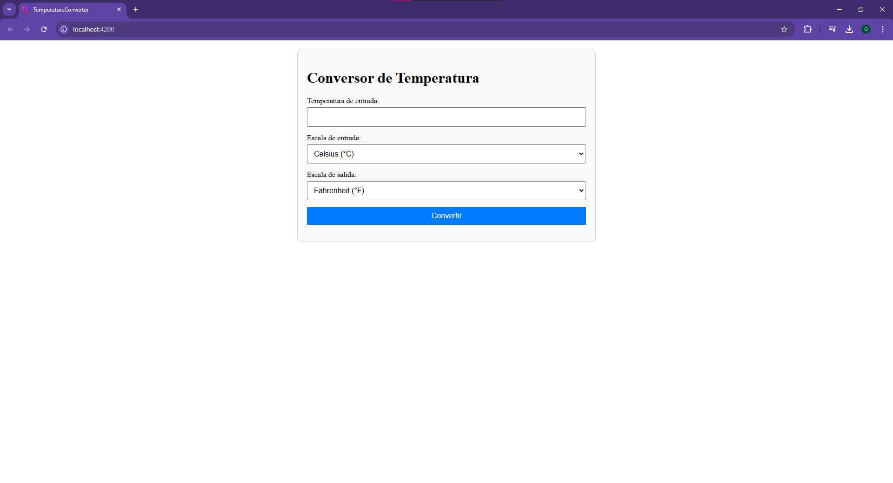

# Conversión de Temperatura - Aplicación Angular

Este proyecto es una aplicación web desarrollada utilizando Angular que permite realizar conversiones entre diferentes escalas de temperatura: Celsius (°C), Fahrenheit (°F) y Kelvin (K). La aplicación permite a los usuarios ingresar un valor de temperatura en una escala y obtener el valor equivalente en las otras dos escalas.

## Funcionalidades

La aplicación permite realizar las siguientes conversiones:

- De **Celsius (°C)** a **Fahrenheit (°F)** y **Kelvin (K)**
  - Fórmula: (°C × 9/5) + 32 = °F
  - Fórmula: °C + 273.15 = K
- De **Fahrenheit (°F)** a **Celsius (°C)** y **Kelvin (K)**
  - Fórmula: (°F − 32) × 5/9 = °C
  - Fórmula: (°F − 32) × 5/9 + 273.15 = K
- De **Kelvin (K)** a **Celsius (°C)** y **Fahrenheit (°F)**
  - Fórmula: K − 273.15 = °C
  - Fórmula: (K − 273.15) × 9/5 + 32 = °F

## Requisitos

- Node.js (versión 14 o superior)
- Angular CLI

## Instalación

1. Clona este repositorio en tu máquina local:
   ```bash
   git clone https://github.com/tu-usuario/conversion-temperatura.git
   ```

2. Navega al directorio del proyecto:
   ```bash
   cd conversion-temperatura
   ```

3. Instala las dependencias del proyecto:
   ```bash
   npm install
   ```

4. Ejecuta la aplicación:
   ```bash
   ng serve
   ```

   La aplicación estará disponible en `http://localhost:4200`.

## Uso

1. Abre la aplicación en tu navegador.
2. Ingresa un valor de temperatura en una de las cajas de entrada (por ejemplo, en Celsius).
3. La aplicación realizará automáticamente la conversión y mostrará el valor equivalente en Fahrenheit y Kelvin.

## Interfaz de Usuario

A continuación, se muestra cómo luce la interfaz de usuario de la aplicación:



## Estructura del Proyecto

- `src/app/`: Contiene los archivos principales de la aplicación Angular.
  - `app.component.ts`: Componente principal de la aplicación.
  - `app.component.html`: Plantilla HTML para la interfaz de usuario.
  - `app.component.css`: Estilos CSS para la aplicación.

- `src/assets/`: Archivos estáticos (imágenes, iconos, etc.).
- `angular.json`: Configuración de Angular CLI.


## Licencia

Este proyecto está bajo la Licencia GNU General Public License v2 (GPL-2.0).

## Autor

- [Angelo Ojeda](https://github.com/AngeloMihaelle)
